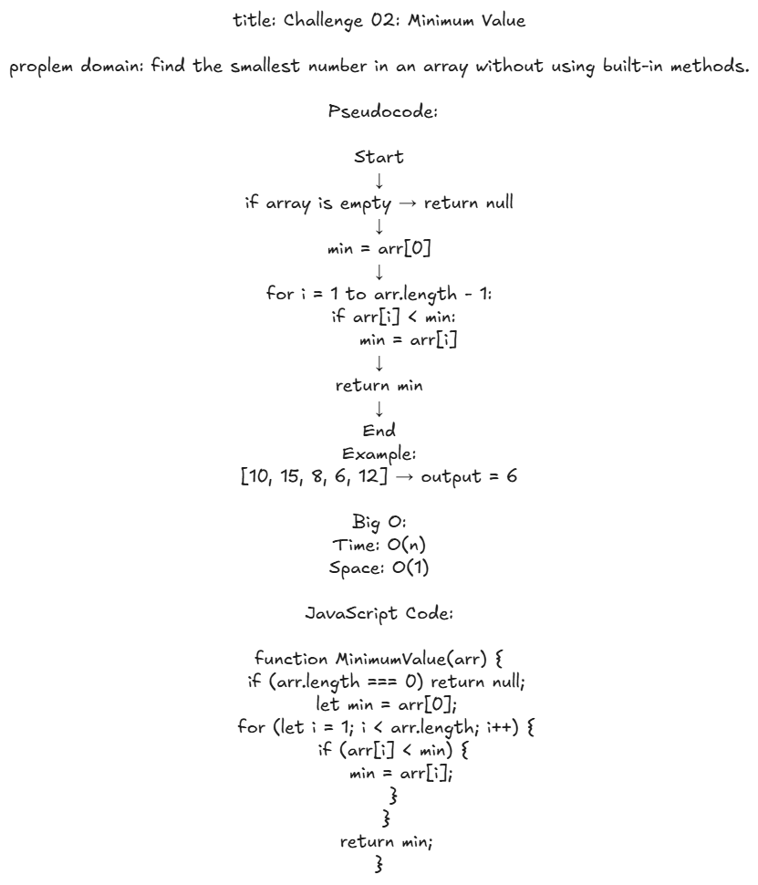

# Challenge 02: Minimum Value

## Problem Domain
Write a function that returns the smallest number in an array of integers without using built-in methods.

## Whiteboard Process


## Solution
```javascript
function MinimumValue(arr) {
  if (arr.length === 0) return null;
  let min = arr[0];
  for (let i = 1; i < arr.length; i++) {
    if (arr[i] < min) {
      min = arr[i];
    }
  }
  return min;
}

"C:\Users\Student\Desktop\New folder (4)\Minimum-Value.png"