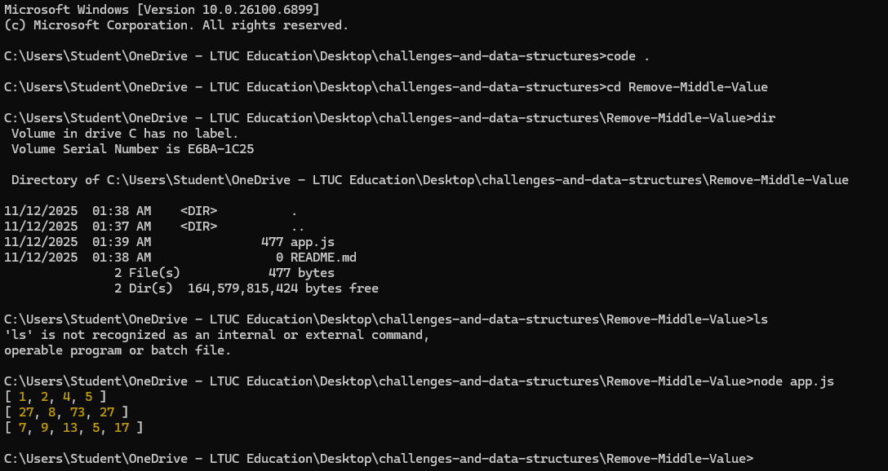

# Challenge: Remove Middle Value

## Challenge Description
Write a function called **removeMiddleValue** that takes in an array as its parameter.  
Without using any built-in array methods (like `splice`, `slice`, or `filter`),  
the function should remove the element located at the **middle index** of the array  
and return the **modified array**.

If the array has an even number of elements, remove the one at the **lower middle index**.


## Example

| Input | Output |
|--------|---------|
| [1, 2, 3, 4, 5] | [1, 2, 4, 5] |
| [27, 8, 15, 73, 27] | [27, 8, 73, 27] |
| [7, 9, 13, 25, 5, 17] | [7, 9, 13, 5, 17] |

---

## Whiteboard Image
![Remove-Middle-Value] 


## Approach and Efficiency
1. Calculate the **middle index** using `Math.floor(arr.length / 2)`.
2. Use a `for` loop to iterate through all elements of the array.
3. Skip the element whose index equals the middle index.
4. Push all other elements into a new array.
5. Return the new array.

**Time Complexity:** O(n)  
**Space Complexity:** O(n)

---

## Solution Code (JavaScript)

```js
function removeMiddleValue(arr) {
  const middleIndex = Math.floor(arr.length / 2);
  const result = [];

  for (let i = 0; i < arr.length; i++) {
    if (i !== middleIndex) {
      result.push(arr[i]);
    }
  }

  return result;
}

// Example test cases
console.log(removeMiddleValue([1, 2, 3, 4, 5]));     // [1, 2, 4, 5]
console.log(removeMiddleValue([27, 8, 15, 73, 27])); // [27, 8, 73, 27]
console.log(removeMiddleValue([7, 9, 13, 25, 5, 17])); // [7, 9, 13, 5, 17]